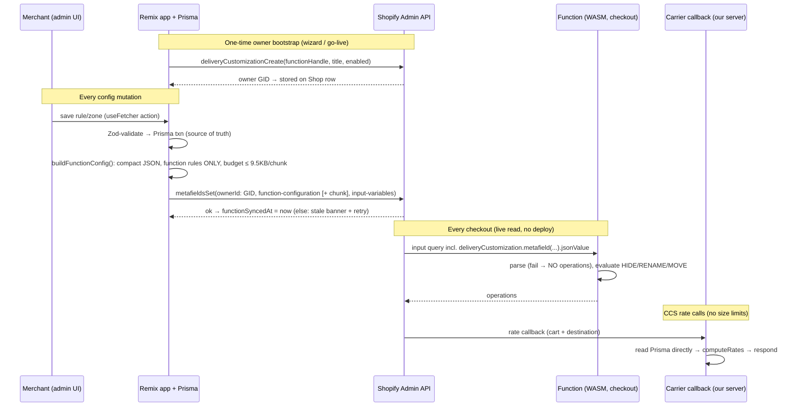

# ShipMath — Architecture

Living record of system-shape decisions. Updated by Architect when a spec changes
the architecture. Specs live in `.specs/`; this file explains *why*, specs explain *what*.

---

## A1 — Configuration pathway: backend → Delivery Customization Function

**Status: DECIDED (2026-09-05). Supersedes the "shop metafield mirror" wording in
specs 002/006 prior to this date.**

### Constraints that forced the design (doc-verified)

| # | Constraint | Consequence |
|---|-----------|-------------|
| 1 | Functions are **pure**: no network, no filesystem, no clock | The Function can never call our API or DB. Config must ride in via the input query. |
| 2 | Canonical config pattern = **metafield on the function owner** (`deliveryCustomization`), namespace `$app:delivery-customization`, key `function-configuration` | Shop-level metafields are NOT the supported carrier for function input. Owner GID must be known and tracked. |
| 3 | **Functions receive `null` for metafield values > 10,000 bytes** (JSON metafields store up to 128KB, but the Function can't see beyond 10KB per value) | Config must be compact, budgeted, and chunked with a hard ceiling. |
| 4 | Input query executes **per checkout run** | Config updates go live at the next checkout — no redeploy, but also no transactional coupling to Prisma writes. |
| 5 | Max **25 active delivery customizations** per store; owners can be deleted/disabled by merchants in admin | App uses exactly ONE owner, tracks its GID, and self-heals if the merchant deletes it. |
| 6 | Carrier Service callback runs on **our server** | Rate rules have NO size constraint — they read Prisma directly. Only function-kind rules need mirroring. |
| 7 | Input query **max cost 30** (metafield = 3, `hasTags` = 3, leaf = 1) | Full-cart + 3 metafields ≈ 29/30 → at most primary config + ONE chunk slot + ONE variables metafield. |
| 8 | Input-query **variables** (list type ≤ 100 elements) are populated from ONE JSON metafield on the owner via `[extensions.input.variables]` | Product/customer tag conditions ride as `pt`/`ct` variables consumed by `hasTags(tags:$pt/$ct)` — no plain tags field exists in the Function schema. |
| 9 | Required scopes: `read_delivery_customizations`, `write_delivery_customizations` (NOT `write_shipping`) | Needed for `deliveryCustomizationCreate/Update` + reading owners. Scope change → dev-store reauth prompt on next `shopify app dev`. |

### The decision: two lanes



**Lane 1 — Function lane (mirrored, size-budgeted).** Only what the Function needs:
`testMode`, `evaluationMode`, zones (for destination matching), and rules of kind
`HIDE` / `RENAME` / `MOVE` with their conditions. Rule *names*, ids kept short,
CARRIER_RATE rules and rate math are **excluded** — the Function never prices anything.

**Lane 2 — Carrier lane (server-side, unlimited).** `CARRIER_RATE` rules, tier tables,
handling fees, presentment logic stay in Prisma and are read by the carrier callback
(spec 007) and simulator (008) at runtime. No mirroring, no limits.

### Function config payload v1 (compact encoding)

- Minified JSON, short keys, `configVersion` first (`v`) for forward compatibility:
  `{ "v":1, "t":0, "m":"F", "z":[…zones…], "r":[…function rules…] }`
  (`m`: `"F"` = FIRST_MATCH, `"A"` = ALL_MATCH; `t`: 0/1 test mode)
- Zones: `{ "i":id, "c":["US"], "p":["CA"], "pc":[{"m":"P","x":"94"}] }` —
  postal lists stored as mode-coded entries (`E`xact/`P`refix/`R`ange/`C`ontains);
  exact lists sorted (prefix-compressible later).
- Rules: `{ "i":id, "k":"H"|"R"|"M", "p":priority, "s":0|1 stop, "z":zoneId?, "c":conditionTree, "a":action }`.
- **Budget:** hard cap 9,500 bytes for the whole config (headroom under the
  10,000-byte function-read limit). Exceeding it raises `ConfigTooLargeError` →
  the UI blocks the sync with guidance (postal-heavy zones are the usual culprit).
- **Chunking (reserved, not capacity-expanding):** the input query also aliases
  one string slot `c1` (`function-configuration-1`). When the payload must split,
  the primary metafield holds a manifest `{"v":1,"chunked":true,"parts":n}` and
  `c1` holds the payload string; the Function detects the manifest and parses `c1`.
  With the query-cost cap (30) there is only room for ONE chunk slot, so the
  effective ceiling remains ~9.5KB in MVP — the slot exists so the read side is
  already forward-compatible if the cost budget ever grows. Exceeding the cap =
  hard UI block with guidance (not a silent behavior change).
- **Tag conditions via input-query variables:** distinct product (`pt`) and
  customer (`ct`) tags referenced by any rule are pushed as a second JSON
  metafield `input-variables` (`{"pt":[…],"ct":[…]}`, ≤ 100 tags each) and wired
  through `[extensions.input.variables]` in `shopify.extension.toml`; the query
  uses `hasTags(tags:$pt)` / `hasTags(tags:$ct)` because Product/Customer expose
  no plain tags field to Functions. Variables are declared nullable — a missing
  metafield resolves to null and evaluation simply sees empty tag lists.
- **UI budget meter** on the rules page (bytes used / ceiling) — merchants see the
  cost of postal-heavy zones as they build.

### Owner lifecycle & idempotency

- Created once per shop at wizard completion / go-live:
  `deliveryCustomizationCreate(deliveryCustomization: { functionHandle: "delivery-customization", title: "ShipMath delivery rules", enabled: true })`.
- GID persisted on `Shop.functionOwnerId`. Bootstrap is idempotent: if null or the
  owner no longer resolves (query `deliveryCustomizations`), recreate — recovers from
  merchant deletion. One owner per shop (limit 25/store; we use 1).
- `ui.enable_create = false` in `shopify.extension.toml` (verify exact key on
  implement) so merchants don't create stray duplicates; they may still toggle
  enabled state — Settings surfaces owner active/disabled state.
- `app/uninstalled` cascades Prisma; Shopify deletes the owner with the app.

### Failure semantics (fail-open, always)

| Failure | Behavior |
|---------|----------|
| `metafieldsSet` fails | Prisma commit stands; `functionSyncedAt` stale → banner + retry action |
| Config > 9,500 bytes | `ConfigTooLargeError` blocks the sync in the UI with guidance |
| Metafield null / > 10KB / unparseable in Function | Return NO operations (pass-through checkout) — never throw |
| `testMode: true` | Function returns NO operations (configure safely, preview in simulator) |
| Owner deleted by merchant | Next settings load detects + recreates + resyncs |

### Alternatives considered — rejected

- **Shop metafield read from input query** — not the supported pattern; docs warn
  input does not utilize shop/app-installation metafields; owner metafield is canonical.
- **`[extensions.input.variables]` for the whole config blob** — same owner-metafield
  source, adds deploy coupling; no benefit for a single blob. We DO use this mechanism,
  but only for the small `pt`/`ct` tag lists (constraint 8), not the config itself.
- **HTTP fetch from Function** — impossible; Functions are sandboxed, no network.
- **Config compiled into the wasm bundle** — rebuild + redeploy per merchant edit; absurd.
- **Metaobjects as config storage** — same 10KB function-read limit applies to
  metaobject fields in input queries; adds a second system for zero gain over Prisma.

---

## A2 — Plan-based delivery guidance (summary)

`Shop.plan` cached via `shop/update`; `classifyShopPlan()` in `app/lib/plan.ts` maps
Basic/entry → FUNCTIONS_ONLY (Function lane only), Advanced/Plus/annual-Grow →
CCS_ELIGIBLE, dev stores → ALL. Detail in spec 003.

---

## A3 — Carrier Service lane: registration, callback contract, lane capabilities

**Status: DECIDED (2026-09-05). Backs specs 003/007/008.**

### Registration lifecycle (mirrors the function-owner pattern)

- Exactly ONE carrier service per shop (`name: "ShipMath"`), GID stored on
  `Shop.carrierServiceId` (schema v2). Created only at **go-live**:
  `testMode = false` AND plan CCS-eligible AND explicit merchant action.
- Deleted on test-mode flip and best-effort on uninstall (offline token may already
  be revoked — tolerate failure).
- **No `carrierSyncedAt` counterpart** (deliberate): the function *mirror* can drift
  from Prisma, but registration is binary (exists / doesn't) and cannot drift.
  Settings verifies live via `LIST_CARRIER_SERVICES` when the go-live card loads.
- **CCS detection probe** (spec 003 OQ-1, resolved): lazy `carrierServiceCreate`
  followed by immediate delete on success; error classification reveals CCS-off.
  Never probed on FUNCTIONS_ONLY (Basic) shops. The probe lives behind the "connect
  rates" wizard step and the Settings card only.

### Callback contract (`POST /carrierrates`, public route)

| Aspect | Decision |
|---|---|
| Auth | `X-Shopify-Hmac-Sha256` over the **raw** body (base64, timing-safe compare, same API secret as webhooks) **AND** payload `rate.origin_shop_domain` must match an installed `Shop`. Either fails → `200 {rates: []}` |
| Fail-open | ALWAYS HTTP 200. Never 4xx/5xx (Shopify retry storms). Empty rates = Shopify falls back to stock rates — we never invent charges |
| Latency budget | p95 target < 500ms server-side; hard internal deadline 1500ms → emit empty rates at deadline |
| Response shape | `{rates: [{service_name, service_code, total_price: "<cents STRING>", currency, description?}]}` |
| Currency | Compute in shop currency. If `rate.currency` differs, label the shop currency honestly — **no FX invention** (multi-currency deferred to 016/017) |

### Lane capability matrix (drives editor validation)

The carrier payload exposes `origin_shop_domain`, `currency`,
`destination {country, province, postal_code}`, and
`items[] {name, sku, quantity, grams, price(cents), vendor}` — **no product tags,
no customer identity**.

| Condition field | Function lane (HIDE/RENAME/MOVE) | Carrier lane (CARRIER_RATE) |
|---|---|---|
| subtotal, weight, quantity, sku, vendor, zone/destination | ✅ | ✅ |
| product_tag, customer_tag, logged_in | ✅ (via `pt`/`ct` variables) | ❌ blocked in editor + Zod refine |

### Rate math pipeline (pure, shared with simulator)

1. **Base**: `flat` amount · `free` (0) · `tiered` lookup on weight/subtotal/quantity
   bands · `percentage` of subtotal
2. `+ perItem.amount × max(0, qty − perItem.freeItems)`
3. `+ perWeight.amount × weight / perWeight.per`
4. `+ handlingFee`
5. `cap` clamp (max), then round half-up to cents → decimal/cents **string**

All internal money is decimal strings; cents conversion happens only at the
response boundary. Stored action JSON for `kind = CARRIER_RATE`
(`CarrierRateActionSchema`, Zod, app-side):

```ts
{
  mode: "flat" | "free" | "tiered" | "percentage",
  amount?: string,                 // shop-currency decimal (flat)
  percentage?: number,             // 0–100 (percentage)
  tiers?: Array<{ basis: "weight" | "subtotal" | "quantity", from: number, to?: number, amount: string }>,
  perItem?: { amount: string, freeItems?: number },
  perWeight?: { amount: string, per: "kg" | "lb" },
  handlingFee?: string,
  cap?: string,
  serviceName: string, serviceCode: string, description?: string
}
```

### Callback logging

Every live callback → one `RequestLog` row (`source: CARRIER_CALLBACK`): bounded
input snapshot JSON (destination, subtotal, weight, quantity, currency — no customer
PII beyond destination), matched rule ids in order, returned rates, latencyMs.
Insert is fire-and-forget (errors swallowed — logging must never break the
response). Every 20th insert triggers a 30-day prune for that shop (spec 008).

---

## A4 — Trust surface: simulator parity, explain traces, module purity boundary

**Status: DECIDED (2026-09-05). Backs specs 008/018.**

- **Parity by construction**: the simulator, the carrier engine, and the Function
  mirror builder all call the SAME pure evaluator modules. Acceptance: simulator
  output must be byte-identical to `computeRates` for shared fixtures (006/008
  shared criterion). The simulator evaluates the **wire config** for function-kind
  rules (literally what checkout reads) plus Prisma carrier rules through
  `computeRates` — the two lanes exactly as production.
- **Module purity boundary** (enforced by import graph, reviewed in PRs):

  | Bundled into WASM (Function) | App/server only (never bundled) |
  |---|---|
  | `app/lib/zone-matching.ts`, `app/lib/rule-evaluation.ts` | `rule-explain.ts`, `carrier/*`, `function-config.ts`, `config-schema.ts` (Zod), `simulate.ts`, `ai/*`, repositories |

  Rationale: keep the wasm bundle minimal; tracing/explain code stays app-side.
- **`explainRules(config, facts, destination)`** lives in `app/lib/rule-explain.ts`
  (app-side, pure): returns per-rule `{ruleId, matched, failedConditionPath?,
  zoneGate?}` by wrapping `evaluateConditionGroup` with a path collector and
  reusing `explainZoneMatch` (already in zone-matching). Feeds the simulator trace
  (008) and the AI debugging direction (018).
- Simulator runs persist as `RequestLog` rows with `source: SIMULATION`, same shape
  as carrier rows including input snapshot and trace (in `matched`).

---

## A5 — Shop prefs & derived onboarding state

**Status: DECIDED (2026-09-05). Backs specs 003/010.**

- `Shop.prefs` (JSON, schema v2) is the **only** home for UI-dismissal state:
  `{ dismissedHints: string[], planBannerDismissedFor?: string,
  checklistDismissedAt?: string }`. No per-banner columns — dismissal is UI state,
  not domain state.
- Onboarding checklist booleans (010) are **derived**, never stored: install =
  Shop row exists; zone created = zone count > 0; rule created = rule count > 0;
  simulation run = ∃ `RequestLog(SIMULATION)`; go-live reviewed =
  `carrierServiceId ≠ null` or explicit skip flag in prefs.

---

## A6 — AI assistant data boundaries

**Status: DECIDED (2026-09-05). Backs spec 009.**

- **Outbound prompts carry configuration-shaped data only** (zones, rules, Zod
  schema excerpt, config summary). Never customer records; no request-log PII in
  setup mode. (018's reverse mode will send log inputs — destination-level only,
  re-specified then.)
- Provider abstraction via env (`AI_PROVIDER`, `AI_MODEL_SMALL`, `AI_MODEL_LARGE`,
  keys) — no provider lock-in in code.
- Pipeline: model output → Zod proposal schema → one repair round-trip → diff
  preview → merchant confirm → **normal rule/zone mutations** (never direct DB
  writes from model output).
- Quota: `AiUsageDay` (`@@unique([shopId, day])`) incremented per provider call;
  cap default 50/shop/day, env-tunable, soft in-app notice.
- Audit: every applied proposal → `AuditLog` with `actor: AI` and before/after
  snapshot; revert = restore snapshot (round-trip unit-tested).
